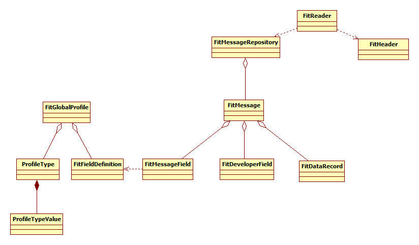

# FitReader
## FIT
FitReader is a library to read ANT/Garmin _.FIT_ files. FIT stands for _Flexible and Interoperable Data Transfer_ and is a Garmin protocol widely used for storing and transfering sports and activity related data. FitReader can be used to read and decode the FIT content for further processing.

The [FIT protocol](https://developer.garmin.com/fit/overview/) is based on Messages, each consisting of Fields of a certain data type. Possible Messages, Fields and Types are defined in the _Global FIT Profile_ which is part of the [Garmin FIT SDK](https://developer.garmin.com/fit/download/), in the form of an excel sheet Profile.xlsx.

A device, for example my Edge830 cycle computer, support a certain subset of the Global FIT Profile. This subset is called the Device Profile.

---
Note: Apparently with updates of the Global FIT Profile, messages are added. However, sometimes Message definitions are _removed_. An example is the Waypoints message (ID 29). However, this message is used by devices like the Edge 810 and Edge 830. Being not present in the Global FIT Profile means this message is no longer recognized in the FIT data.

---


## Working of the software
.FIT files are converted to a **FitRecordRepository**, consisting of **FitMessage**s for each .FIT defined FIT Message.

A **FitMessage** consists of
* **FitMessageField**s defining the local message structure referring to the Global FIT profile
* optional **FitDeveloperField**s defining developer defined fields.
* **FitDataRecord**s, records containing data conform the field definitions

The global FIT profile is read into **FitGlobalProfile** from the excel file enclosed in de Garmin/ANT FIT SDK. The profile definition consists of data types and global message field definitions.

**FitReader** is the entry point of the library. It offers functions to read FIT files. The main function is **FitReader:readFile()**, which does the reading and conversion and results in the **FitRecordRepository** containing the read **FitMessage**s. The **FitMessageRepository** can be used to obtain the message definition and data. 




Messages (message and field names) are defined in /src/main/resources/Profile.xlsx (this file originates from the .FIT SDK that can be downloaded at the [ANT site](https://www.thisisant.com/resources/fit); this SDK also contains PDFs describing the .FIT format). However, implementers like Garmin appear to have added their own proprietary fields which are not defined in the Excel sheet. 

Developer fields within a message are defined in the FIT file itself, by means of two regular fields (_developer_data_id_ and _field_description_).


# Building
Use Maven to compile the source files into /target. The project is recognized by Netbeans as Maven project and can be imported. Or build manually:

```
mvn clean install
```

This results in two jar files: one library and one for the javadoc. Usage is illustrated in the test files.


# Dependencies
The software uses 
- hirondelle-date4j-1.5.1.jar


# Information
Javadoc: Refer to the Javadoc in the /target file.
Blog:    http://blog.studioblueplanet.net/?page_id=468


Garmin Track Converter
The Garmin track converter uses this library to convert .FIT tracks to .GPX format

Source: https://github.com/scubajorgen/GarminTrackConverter